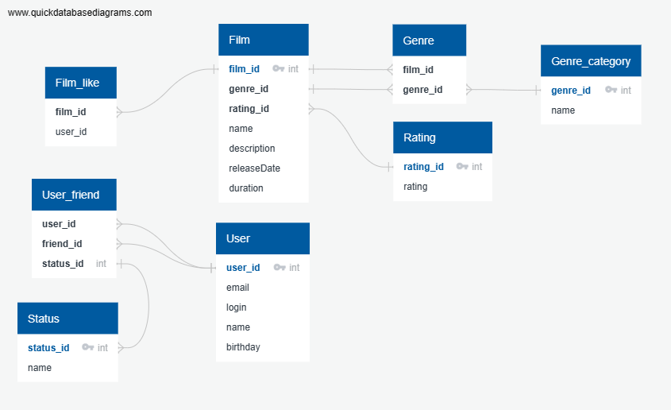

   ER-diagram


()


Описание Film
«Жанр» (англ. Genre). У фильма может быть сразу несколько жанров, а у поля — несколько значений. Например, таких:
```
* Комедия
* Драма
* Мультфильм
* Триллер
* Документальный
* Боевик
```
Рейтинг Ассоциации кинокомпаний (англ. Motion Picture Association, сокращённо МРА). Эта оценка определяет возрастное ограничение для фильма. Значения могут быть следующими:
```
* G — у фильма нет возрастных ограничений
* PG — детям рекомендуется смотреть фильм с родителями
* PG-13 — детям до 13 лет просмотр не желателен
* R — лицам до 17 лет просматривать фильм можно только в присутствии взрослого
* NC-17 — лицам до 18 лет просмотр запрещён
```
Описание User
Статус для связи «дружба» между двумя пользователями:
```
* неподтверждённая — когда один пользователь отправил запрос на добавление другого пользователя в друзья,
* подтверждённая — когда второй пользователь подтвердил заявку на добавление.
```

Пример запроса на получение самого популярного фильма:

```
SELECT MAX(Count(f.film_id))
FORM film AS f
LEFT JOIN user_like AS usl f.film_id = usl.film_id
GROUP BY f.film_id;
```

Пример запроса на получение id друзей пользователей
```
SELECT 
u.user_id
uf.friend_id
FROM user AS u
INNER JOIN user_friend AS uf u.user_id = uf.user_id
GROUP BY u.user_id;
```